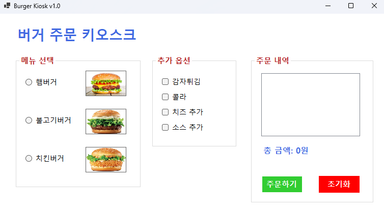
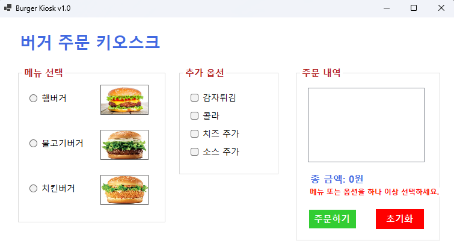
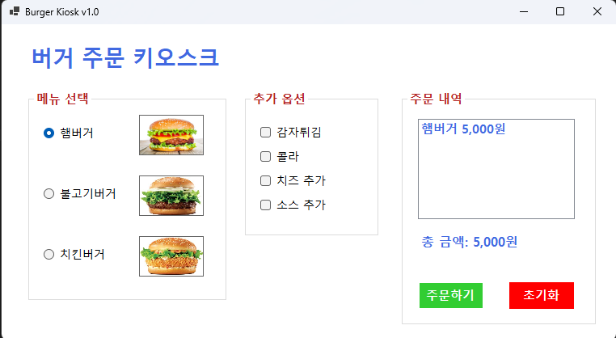

# (C# 코딩) 버거 주문 키오스크

## 개요

- C# 프로그래밍 학습
- 1줄 소개: 사용자가 메뉴와 추가 옵션을 선택하여 주문을 구성하고, 선택 결과를 즉시 반영하는 키오스크 프로그램
- 사용한 플랫폼:
- C#, .NET Windows Forms, Visual Studio, GitHub
- 사용한 컨트롤:
- Label, RadioButton, CheckBox, ListBox, Button, GroupBox, PictureBox
- 사용한 기술과 구현한 기능:
- Visual Studio를 이용하여 UI 디자인
- Checked 속성을 활용한 사용자 선택 데이터 처리
- 이벤트(Click, CheckedChanged)를 활용한 기능 구현
- 키보드 입력(Tab, 방향키, Enter)을 통한 UI 제어
- 문자열 포맷(ToString("N0"))을 이용한 금액 출력

## 실행 화면

- 코드의 실행 스크린샷과 구현 내용 설명

- 구현한 내용 (위 그림 참조)

- 본 과제에서는 Windows Forms를 이용하여 버거 주문 키오스크의 기본 UI와 기능을 구현하였다. 메뉴 선택을 위해 RadioButton을 사용하여 햄버거, 불고기버거, 치킨버거 중 하나만 선택할 수 있도록 구성하였으며, 추가 옵션은 CheckBox를 활용하여 감자튀김, 콜라, 치즈, 소스 등을 중복 선택할 수 있도록 설계하였다. 또한 사용자가 선택한 항목을 ListBox에 출력하여 주문 내역을 확인할 수 있도록 하였고, 각 메뉴와 옵션의 가격을 합산하여 총 금액을 Label에 표시하도록 구현하였다. 주문하기 버튼 클릭 시 선택된 항목이 정상적으로 출력되도록 이벤트를 구성하였으며, 초기화 버튼을 통해 모든 선택 상태와 결과를 초기 상태로 되돌릴 수 있도록 하여 전체적인 주문 흐름을 완성하였다.

## 실행 화면

- 코드의 실행 스크린샷과 구현 내용 설명

- 구현한 내용 (위 그림 참조)

- 과제 2에서는 사용자 입력에 대한 예외 처리를 개선하여 프로그램의 안정성을 높이고자 하였다. 기존에는 아무 항목도 선택하지 않은 상태에서 주문하기 버튼을 누를 경우 별도의 안내 없이 동작하거나 MessageBox를 사용하는 방식이 일반적이었으나, 본 과제에서는 사용자 경험을 고려하여 화면 내부의 Label을 이용해 에러 메시지를 출력하도록 구현하였다. 메뉴와 옵션이 모두 선택되지 않은 경우 조건문을 통해 이를 판단하고, Label에 “메뉴 또는 옵션을 하나 이상 선택하세요.”라는 메시지를 표시하도록 하였다. 이를 통해 사용자가 현재 상태를 직관적으로 인지할 수 있도록 하였으며, 불필요한 팝업 창을 제거하여 보다 자연스러운 인터페이스를 제공하였다. 또한 주문이 정상적으로 이루어질 경우에는 해당 메시지를 초기화하여 화면이 깔끔하게 유지되도록 처리하였다.

## 실행 화면

- 코드의 실행 스크린샷과 구현 내용 설명

- 구현한 내용 (위 그림 참조)
 
- 과제 3에서는 마우스를 사용하지 않고도 키보드만으로 프로그램을 조작할 수 있도록 기능을 확장하였다. Tab 키를 이용하여 메뉴 선택 영역, 옵션 선택 영역, 버튼 영역으로 포커스가 이동하도록 TabIndex를 설정하여 흐름을 구성하였으며, 방향키를 이용하여 동일 그룹 내의 항목 간 이동이 가능하도록 KeyDown 이벤트와 SelectNextControl 메서드를 활용하였다. 또한 RadioButton과 CheckBox는 기본적으로 Space 키를 통해 선택 및 해제가 가능하도록 하였고, Enter 키를 누르면 주문하기 버튼이 실행되도록 AcceptButton 속성을 설정하였다. Esc 키를 통해 초기화 버튼이 실행되도록 CancelButton 속성도 함께 적용하여 키보드 기반 조작의 완성도를 높였다. 이를 통해 접근성과 편의성을 고려한 사용자 중심 인터페이스를 구현하였다.

## 실행 화면

- 코드의 실행 스크린샷과 구현 내용 설명

- 구현한 내용 (위 그림 참조)
 
- 과제 4에서는 사용자 입력에 대한 즉각적인 반응을 구현하기 위해 실시간 업데이트 기능을 추가하였다. 기존에는 주문하기 버튼을 눌러야만 주문 내역과 총 금액이 갱신되었으나, 본 과제에서는 RadioButton과 CheckBox의 CheckedChanged 이벤트를 활용하여 선택이 변경되는 즉시 결과가 반영되도록 개선하였다. 모든 선택 요소에 이벤트를 연결하고, 하나의 공통 함수에서 현재 선택 상태를 확인하여 ListBox와 Label을 동시에 갱신하도록 구성함으로써 코드의 중복을 줄이고 유지보수성을 높였다. 또한 아무 항목도 선택되지 않은 경우에는 주문 내역을 초기화하고 총 금액을 0원으로 표시하도록 처리하여 상태를 명확하게 표현하였다. 금액 출력 시에는 ToString("N0")을 사용하여 천 단위 구분 기호를 적용함으로써 가독성을 향상시켰다.
